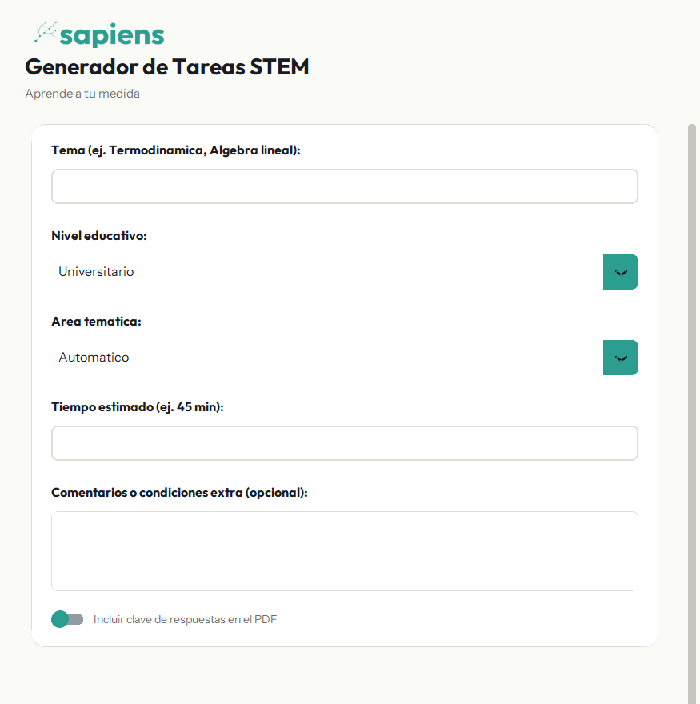

# Sapiens STEM Generator

AI-powered desktop application that generates pedagogically calibrated STEM evaluations as PDFs. Given a topic, educational level, and time budget, it runs a two-pass AI pipeline (generation + validation) with a fallback chain across Groq's free-tier LLMs, retrieves real-world context from ArXiv and the web, and renders the output as a professional PDF in the Sapiens visual identity.

Built for **[Sapiens](https://sapienseducation.com)**.



## What it does

Given a topic like "Thermodynamics" at "University" level for a "45 min" exam, the system:

1. **Detects the subject area** (math, science, engineering, CS, humanities) and normalizes the educational level.
2. **Pulls real-world context** from a curated knowledge base, ArXiv (for advanced levels), and bilingual DuckDuckGo searches.
3. **Generates the questions** with one of Groq's free-tier 70B-class models, falling back through a chain (Llama 3.3 70B → Llama 4 Scout → Qwen 3 32B) if quota is exhausted.
4. **Validates pedagogically** in a second LLM pass: Bloom levels, LaTeX correctness, realistic contexts, and rubric completeness.
5. **Renders the PDF** with the Sapiens design system: teal primary color, custom typography, Bloom-based phases, point allocation per question, optional answer key.
6. **Avoids repetition** by maintaining a per-user history of recent topics and injecting "do not repeat these contexts" into every prompt.

## Features

* Two-pass AI pipeline (generation + pedagogical validation)
* Multi-model fallback chain across Groq's free tier
* Real-world context retrieval (ArXiv, web bilingual search, curated knowledge base)
* Robust JSON parser that fixes LaTeX escape collisions in LLM output
* Bloom taxonomy-aware question structure (recall → understand → apply → analyze → evaluate)
* Repetition avoidance via persistent generation history
* Custom PDF rendering with embedded LaTeX formulas
* Optional answer key with rubrics
* Light-first UI in the Sapiens visual identity

## Tech Stack

* Python 3.10+
* [CustomTkinter](https://github.com/TomSchimansky/CustomTkinter) for the desktop GUI
* [Groq](https://groq.com) Python SDK for LLM inference (Llama 3.3 70B, Llama 4 Scout, Qwen 3 32B)
* Google Generative AI (optional, reserved for future utilities)
* [fpdf2](https://pyfpdf.github.io/fpdf2/) for PDF generation
* [Matplotlib](https://matplotlib.org/) for LaTeX formula rendering
* [arxiv](https://github.com/lukasschwab/arxiv.py) and [ddgs](https://github.com/deedy5/ddgs) for context retrieval

## Sample Output

| Thermodynamics (University) | Chemical Kinetics (University) | Quadratic Functions (High School) |
|---|---|---|
| [PDF](docs/samples/sample_thermodynamics_university.pdf) | [PDF](docs/samples/sample_chemical_kinetics_university.pdf) | [PDF](docs/samples/sample_quadratic_functions_highschool.pdf) |

## Installation

```bash
git clone https://github.com/mateo-ortega/sapiens-stem-generator.git
cd sapiens-stem-generator
python -m venv venv
venv\Scripts\activate          # Windows
source venv/bin/activate       # macOS / Linux
pip install -r requirements.txt
```

Create a `.env` file with your API keys (see `.env.example`):

```
GROQ_API_KEY=gsk_...
GEMINI_API_KEY=...   # optional, reserved for future utilities
```

Free Groq keys are available at [console.groq.com/keys](https://console.groq.com/keys).

## Usage

Launch the desktop application:

```bash
python main.py
```

Or use the bundled Windows batch launcher:

```cmd
Lanzar_Sapiens.bat
```

Fill in the form (topic, level, area, time, optional comments), toggle the answer key switch if needed, and click **Generar Evaluacion STEM**. The generated PDF will be saved to `outputs/Tarea_<topic>.pdf` relative to the script.

## Project Structure

```
sapiens-stem-generator/
├── main.py                          GUI entry point
├── core/
│   ├── ai_agent.py                  Two-pass LLM pipeline with Groq fallback chain
│   ├── knowledge_retriever.py       ArXiv + DDG + curated knowledge merge
│   ├── subject_knowledge.py         Curated curriculum facts by area and level
│   ├── prompts.py                   System prompts, area-specific instructions, language guidelines
│   ├── history_manager.py           Persistent recent-topics history for variety
│   ├── pdf_generator.py             Sapiens-branded PDF renderer (fpdf2)
│   ├── latex_parser.py              LaTeX expression parsing
│   ├── latex_renderer.py            LaTeX to PNG via matplotlib for PDF embedding
│   └── brand.py                     Sapiens design tokens (colors, fonts, spacing)
├── resources/
│   ├── fonts/                       Outfit and Instrument Sans (SIL OFL)
│   ├── logo.png                     Sapiens primary logo
│   ├── sapiens_logo.png             Sapiens horizontal lockup
│   └── sapiens_icon.png             Sapiens window icon
├── docs/
│   ├── samples/                     Generated sample PDFs (committed for reference)
│   └── screenshots/                 README screenshots
├── requirements.txt
├── .env.example
├── Lanzar_Sapiens.bat               Windows launcher
└── LICENSE
```

## Local Data

The application stores per-user state in `~/Sapiens/`:

* `.history.json` keeps the recent-topics history per area and level (FIFO, capped at 50 records per bucket).
* `.context_cache.json` caches LLM-expanded contexts to reduce redundant calls.

These files are local-only and never committed.

## Notes

* Groq's free tier has daily token limits per model. When the primary model hits its quota, the pipeline transparently falls back to the next model in the chain. If all three exhaust, generation fails with a clear message indicating the UTC midnight reset time.
* The pipeline renders LaTeX formulas (`$\\rho \\cdot V$`, etc.) as embedded PNG images, so the PDF is portable and font-independent.
* The output language follows the input language (Spanish in, Spanish out).

## License

[MIT](LICENSE)

## Author

**Mateo Ortega**, Founder of [Sapiens](https://sapienseducation.com)
[teo.ritmos@gmail.com](mailto:teo.ritmos@gmail.com) · [github.com/mateo-ortega](https://github.com/mateo-ortega)
